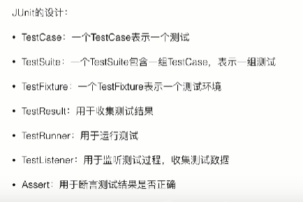
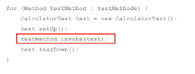

# JUnit
> 目标，通过JUnit实现算法的测试框架

## 面向测试开发；单元测试；覆盖率

## JUnit基础概念

- 

## Before 和 After

每次test之前都要执行before和after
所以可以实现每个test应对的是相同环境。

写在测试类的实例变量中
用于准备测试数据。

有beforeClass， 需要的是static变量
用于打开数据库

## 异常测试

正确地抛出异常也是功能的一部分。
expected = xxx.class
如果抛出异常错误，就失败。

## 参数化测试
@Parameters
static data()

## 超市测试

